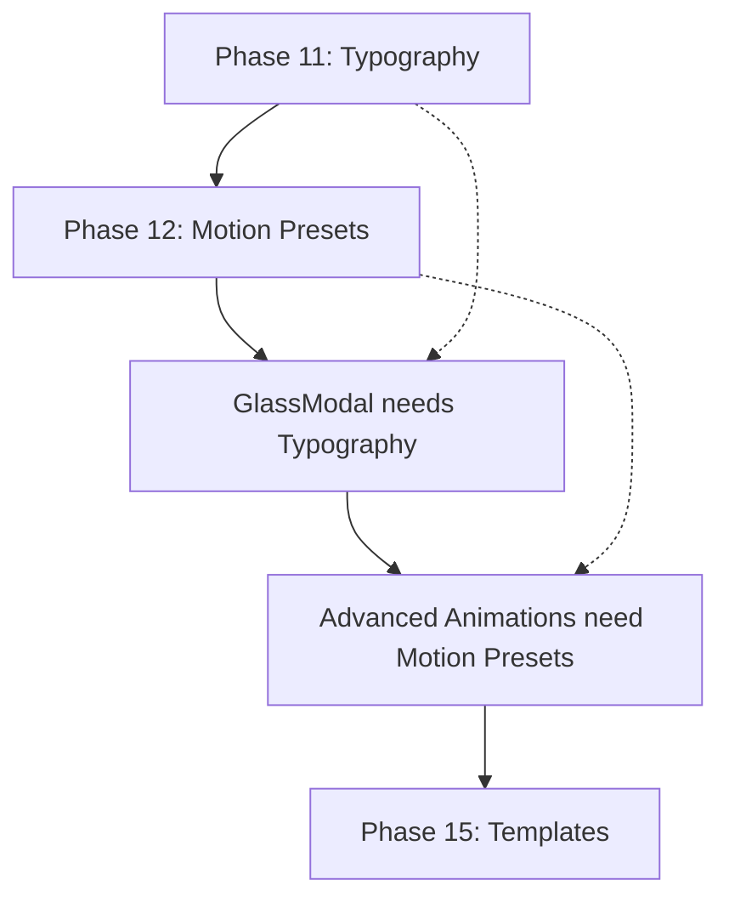

# Task Breakdown & Work Plan

## Implementation Overview
**Total Project Scope**: 15 phases (10 completed, 5 remaining)  
**Current Status**: ~70% complete  
**Estimated Remaining Work**: 14-19 hours

---

## ✅ Completed Phases (1-10)

### Phase 1: Environment Setup ✅
**Completed**: Previous session  
**Duration**: 2 hours  
**Deliverables**:
- [x] All required dependencies installed with --legacy-peer-deps flag
- [x] Peer dependency conflicts resolved
- [x] Development environment configured

### Phase 2: Core CSS System ✅  
**Completed**: Previous session  
**Duration**: 3 hours  
**Deliverables**:
- [x] Complete 25-color Maslow palette as CSS variables
- [x] Aurora gradient system (4 gradients: primary, secondary, mesh, warm)
- [x] Glassmorphism variable system with intensity levels
- [x] 7 keyframe animations implemented
- [x] Dark mode adjustments configured
- [x] Reduced motion accessibility support

### Phase 3: Font Configuration ✅
**Completed**: Previous session  
**Duration**: 1 hour  
**Deliverables**:
- [x] Manrope font (existing) validated
- [x] Graphik font added via Bunny Fonts
- [x] Font feature settings configured (ligatures, kerning)

### Phase 4: Directory Structure ✅
**Completed**: Previous session  
**Duration**: 1 hour  
**Deliverables**:
- [x] `/components/maslow/` directory structure created
- [x] `/hooks/maslow/` directory created
- [x] `/utils/maslow/` directory created
- [x] Barrel export files configured

### Phase 5: AuroraButton Component ✅
**Completed**: Previous session  
**Duration**: 4 hours  
**Deliverables**:
- [x] AuroraButton component with 4 variants (primary, secondary, ghost, warm)
- [x] 4 size variants (sm, md, lg, xl)
- [x] Advanced features: glow, morphing, intensity levels
- [x] Framer Motion integration with spring physics
- [x] Comprehensive Storybook story
- [x] Accessibility: reduced motion support via useReducedMotion hook

### Phase 6: GlassCard Component ✅
**Completed**: Previous session  
**Duration**: 4 hours  
**Deliverables**:
- [x] GlassCard component with glassmorphism effects
- [x] 3D tilt interactions with mouse tracking
- [x] 3 intensity levels (subtle, medium, strong)
- [x] 4 gradient overlays (aurora, warm, cool, none)
- [x] Interactive features: floating animation, hover states
- [x] Comprehensive Storybook story

### Phase 7: Aurora Background (WebGL) ✅
**Completed**: Previous session  
**Duration**: 5 hours  
**Deliverables**:
- [x] Three.js integration with React Three Fiber
- [x] Custom GLSL vertex and fragment shaders
- [x] Real-time animation with time-based uniforms
- [x] Performance optimizations: lazy loading, GPU acceleration
- [x] Color synchronization with Maslow brand palette
- [x] useAurora hook for intensity controls

### Phase 8: Storybook Integration ✅
**Completed**: Previous session  
**Duration**: 2 hours  
**Deliverables**:
- [x] Individual component stories for AuroraButton and GlassCard
- [x] Interactive controls for all component props
- [x] Background variants for testing (aurora gradient, dark)
- [x] Comprehensive documentation examples

### Phase 9: Showcase Demo ✅
**Completed**: Previous session  
**Duration**: 3 hours  
**Deliverables**:
- [x] Complete Maslow showcase demonstration
- [x] Hero section with aurora background and floating elements
- [x] Component library showcase with live examples
- [x] Interactive demonstration of all features
- [x] Performance-optimized implementation

### Phase 10: Quality Assurance ✅
**Completed**: Previous session  
**Duration**: 2 hours  
**Deliverables**:
- [x] All TypeScript errors resolved (GlassCard HTMLMotionProps issue fixed)
- [x] ESLint formatting applied (1367 warnings resolved)
- [x] Prettier code formatting applied across all files
- [x] Performance optimizations verified (GPU acceleration, reduced motion)

---

## 🎯 Remaining Phases (11-15)

### Phase 11: Typography Component System 
**Status**: 🔴 Next Priority  
**Estimated Duration**: 2-3 hours  
**Dependencies**: None

#### Tasks Breakdown
- [ ] **Create Typography component** (`/components/ui/typography.tsx`)
  - [ ] Implement 9 variants (h1-h6, body1-2, caption)
  - [ ] Add gradient text support via `bg-clip-text`
  - [ ] Include responsive sizing (mobile/desktop)
  - [ ] Semantic HTML element mapping
- [ ] **Add TypeScript interfaces**
  - [ ] Comprehensive props interface with JSDoc
  - [ ] Support for `as` prop for semantic flexibility
  - [ ] Integration with existing className patterns
- [ ] **Create Storybook story** (`/components/ui/typography.story.tsx`)
  - [ ] All typography variants displayed
  - [ ] Gradient text examples
  - [ ] Responsive behavior demonstration
- [ ] **Update showcase demo**
  - [ ] Add typography examples to maslow-showcase.demo.tsx
  - [ ] Test gradient text in context

#### Acceptance Criteria
- [ ] All 9 typography variants render correctly
- [ ] Gradient text functionality works on all variants
- [ ] Responsive scaling functions properly
- [ ] Accessibility (contrast ratios, semantic HTML) verified
- [ ] Storybook story comprehensive and functional

### Phase 12: Motion Animation Presets Library
**Status**: 🔴 Critical  
**Estimated Duration**: 3-4 hours  
**Dependencies**: None (Framer Motion already installed)

#### Tasks Breakdown
- [ ] **Create animation presets library** (`/lib/animations/`)
  - [ ] `motion-presets.ts`: fadeInUp, scaleIn, slideInFromLeft, staggerContainer
  - [ ] `spring-configs.ts`: Consistent spring physics configurations
  - [ ] `index.ts`: Barrel exports for easy importing
- [ ] **Build scroll animation hooks** (`/hooks/`)
  - [ ] `useScrollAnimation.ts`: Scroll-triggered animations with IntersectionObserver
  - [ ] `useGradientShift.ts`: Dynamic gradient position animations
  - [ ] `useScrollMorph.ts`: Morphing effects based on scroll position
- [ ] **Create motion wrapper components**
  - [ ] Basic motion containers using the preset library
  - [ ] Stagger animation containers
- [ ] **Add Storybook stories**
  - [ ] Animation preset demonstrations
  - [ ] Scroll trigger examples
  - [ ] Performance profiling stories

#### Acceptance Criteria
- [ ] All animation presets function smoothly at 60fps
- [ ] Scroll animations trigger correctly with intersection observer
- [ ] Reduced motion preferences respected across all presets
- [ ] Performance impact minimal (no layout thrashing)
- [ ] Comprehensive documentation in Storybook

### Phase 13: Enhanced Maslow Components
**Status**: 🟡 Important  
**Estimated Duration**: 4-5 hours  
**Dependencies**: Typography component (Phase 11)

#### Tasks Breakdown
##### AuroraCard Component
- [ ] **Create AuroraCard** (`/components/maslow/aurora/aurora-card.tsx`)
  - [ ] Extend existing Card component
  - [ ] 4 variants with aurora backgrounds (primary, secondary, warm, cool)
  - [ ] 3D hover effects with Framer Motion
  - [ ] Integration with GlassCard styling options
- [ ] **Add Storybook story** with all variants and interactive examples

##### GlassModal Component
- [ ] **Create GlassModal** (`/components/maslow/glass/glass-modal.tsx`)
  - [ ] Extend existing Dialog/Modal component
  - [ ] Glass backdrop with blur effects
  - [ ] Aurora gradient overlays
  - [ ] Proper focus management and accessibility
- [ ] **Add Storybook story** with modal examples and interaction demos

##### GlassInput Component
- [ ] **Create GlassInput** (`/components/maslow/glass/glass-input.tsx`)
  - [ ] Extend existing Input component
  - [ ] Glass morphism input styling
  - [ ] Aurora gradient borders on focus states
  - [ ] Floating label animations
  - [ ] Form validation state styling
- [ ] **Add Storybook story** with form examples and state demonstrations

#### Acceptance Criteria
- [ ] All components follow established extension patterns
- [ ] Proper integration with existing component APIs
- [ ] Accessibility standards maintained (WCAG 2.1 AA)
- [ ] Performance targets met (smooth 60fps interactions)
- [ ] Comprehensive Storybook documentation

### Phase 14: Advanced Animation Components
**Status**: 🟡 Important  
**Estimated Duration**: 3-4 hours  
**Dependencies**: Motion presets library (Phase 12)

#### Tasks Breakdown
##### AnimatedSection Component
- [ ] **Create AnimatedSection** (`/components/maslow/motion/animated-section.tsx`)
  - [ ] Multiple animation preset options (fadeInUp, scaleIn, slideInFromLeft)
  - [ ] Stagger animation support for child elements
  - [ ] IntersectionObserver integration for trigger-on-scroll
  - [ ] Configurable animation timing and delays
- [ ] **Add Storybook story** with animation comparisons

##### MorphingText Component  
- [ ] **Create MorphingText** (`/components/maslow/motion/morphing-text.tsx`)
  - [ ] Text that cycles through multiple strings
  - [ ] Configurable morph styles (fade, slide, scale)
  - [ ] Aurora gradient text integration
  - [ ] Pause-on-hover functionality
- [ ] **Add Storybook story** with different morphing styles

##### Float3D Component
- [ ] **Create Float3D** (`/components/maslow/3d/float-3d.tsx`)
  - [ ] 3D floating animation wrapper
  - [ ] Configurable intensity and speed
  - [ ] Integration with existing 3D system
  - [ ] Performance optimized for multiple instances
- [ ] **Add Storybook story** with floating element examples

#### Acceptance Criteria
- [ ] All animation components perform smoothly
- [ ] Proper integration with motion presets library
- [ ] 3D components don't impact performance negatively
- [ ] Reduced motion support comprehensive
- [ ] Storybook stories demonstrate all capabilities

### Phase 15: Templates & Implementation Examples  
**Status**: 🟢 Nice-to-have  
**Estimated Duration**: 2-3 hours  
**Dependencies**: All previous phases complete

#### Tasks Breakdown
##### Hero Section Template
- [ ] **Create HeroSection** (`/components/maslow/templates/hero-section.tsx`)
  - [ ] Combines AuroraBackground + Typography + AuroraButton
  - [ ] Responsive layout with floating decorative elements
  - [ ] Scroll-triggered animations for content reveal
  - [ ] Optimized for performance and accessibility
- [ ] **Add Storybook story** with customization options

##### AI Chat Interface Example
- [ ] **Create AI Chat Interface** (`/components/maslow/templates/ai-chat-interface.tsx`)
  - [ ] Message bubbles with glass effects
  - [ ] Thinking animation with pulsing dots
  - [ ] Aurora gradient avatars
  - [ ] Smooth message animations
- [ ] **Add Storybook story** with chat flow demonstration

##### Performance Optimization Utilities
- [ ] **Create optimization utilities** (`/lib/performance/`)
  - [ ] `optimization.ts`: Performance helper functions
  - [ ] `lazy-loading.ts`: Component lazy loading utilities
  - [ ] `gpu-acceleration.ts`: Animation optimization helpers

#### Acceptance Criteria
- [ ] Templates demonstrate real-world usage patterns
- [ ] Performance optimization utilities provide measurable benefits
- [ ] All examples are production-ready
- [ ] Documentation explains implementation patterns
- [ ] Templates can be easily customized

---

## Task Dependencies & Sequencing

### Critical Path Analysis


### Parallel Work Opportunities
- **Phase 11 & 12**: Can be worked on simultaneously (no dependencies)
- **Phase 13**: AuroraCard and GlassInput can be built in parallel
- **Phase 14**: All three components (AnimatedSection, MorphingText, Float3D) can be built in parallel

---

## Quality Assurance Checklist

### Per-Component Checklist
For each new component, verify:

#### Design System Compliance
- [ ] Uses only approved 25-color Maslow palette
- [ ] Primary actions use gradients (never flat colors)
- [ ] Glass effects applied to floating elements
- [ ] Motion included on all interactive elements
- [ ] Dark mode adjustments included

#### Performance Standards  
- [ ] Animations run at 60fps on target devices
- [ ] GPU acceleration applied to transform/opacity animations
- [ ] Bundle size impact measured and acceptable
- [ ] Lazy loading implemented for heavy components
- [ ] Memory leaks prevented (cleanup on unmount)

#### Accessibility Requirements
- [ ] WCAG 2.1 AA contrast ratios met
- [ ] Keyboard navigation fully functional
- [ ] Screen reader compatibility verified
- [ ] Focus states clearly visible
- [ ] Reduced motion preferences respected
- [ ] ARIA labels provided where needed

#### Code Quality Standards
- [ ] TypeScript strict mode compliance
- [ ] ESLint passes with no warnings
- [ ] Prettier formatting applied
- [ ] JSDoc documentation for public APIs
- [ ] Unit tests for critical functionality
- [ ] Storybook story comprehensive and interactive

### End-of-Phase Reviews
After each phase completion:
1. **Functionality Review**: All features work as specified
2. **Performance Audit**: Lighthouse score maintained >90
3. **Accessibility Audit**: Manual and automated testing
4. **Code Review**: Peer review of implementation approach
5. **Documentation Review**: Storybook stories complete and accurate

---

## Resource Allocation & Timing

### Development Schedule (Estimated)
```
Week 1: Phase 11 (Typography) - 2-3 hours
Week 1: Phase 12 (Motion Presets) - 3-4 hours  
Week 2: Phase 13 (Enhanced Components) - 4-5 hours
Week 3: Phase 14 (Advanced Animations) - 3-4 hours
Week 3: Phase 15 (Templates) - 2-3 hours

Total: 14-19 hours over 3 weeks
```

### Effort Distribution
- **Component Implementation**: 60% (building the actual components)
- **Storybook Documentation**: 25% (comprehensive stories and examples)
- **Testing & QA**: 15% (accessibility, performance, code quality)

### Risk Mitigation
- **Buffer Time**: Add 20% buffer to each phase estimate
- **Dependency Issues**: Keep fallback plans for complex dependencies
- **Performance Issues**: Profile early, optimize incrementally
- **Scope Creep**: Stick to defined requirements, document future enhancements

---

## Next Session Instructions

### Immediate Next Steps
1. **Start with Phase 11** (Typography component) - highest impact, no dependencies
2. **Follow existing patterns** from AuroraButton/GlassCard implementations
3. **Create comprehensive Storybook story** alongside component implementation
4. **Test thoroughly** before moving to next phase

### Session Preparation
1. **Read context files** to understand current state
2. **Review `.plan.md`** for detailed implementation guidance
3. **Check `.changelog.md`** for completed work context
4. **Reference `maslow_branding_kit.V3.md`** for exact specifications

### Development Workflow
1. **Create component** following established patterns
2. **Add TypeScript interfaces** with comprehensive prop definitions
3. **Build Storybook story** with all variants and interactions
4. **Update showcase demo** if component fits the demo context
5. **Run quality checks** (type-check, lint, prettier)
6. **Mark phase complete** and move to next priority

---

*This task breakdown provides a clear roadmap for completing the remaining 30% of the Maslow Design System v3.0 integration. Each phase builds incrementally toward full specification compliance.*